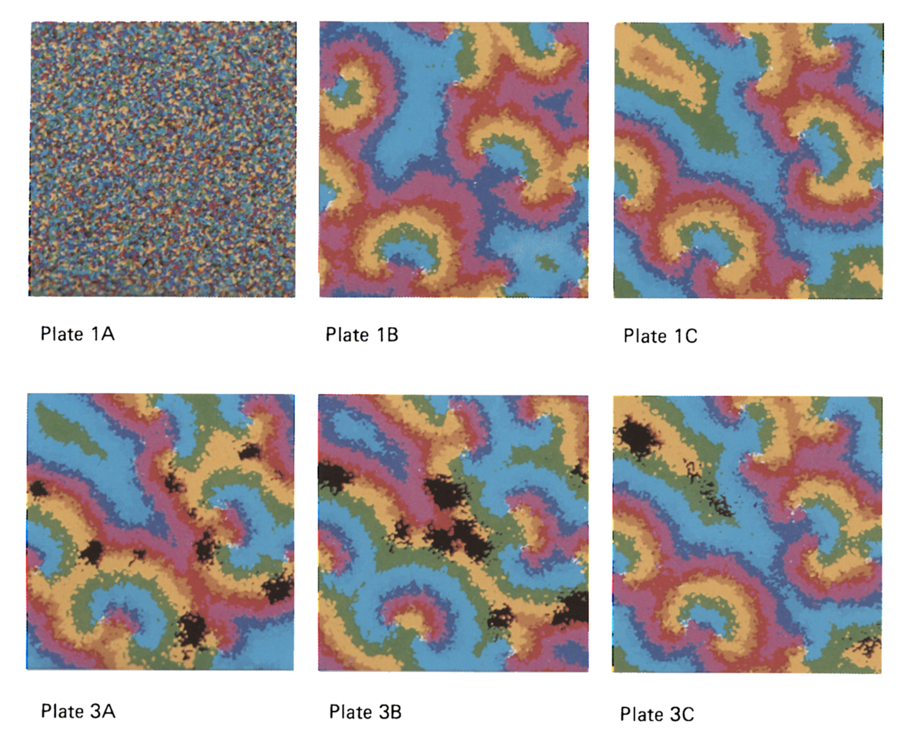

## Hypercycles

Work-in-progress simulation of hypercycles and parasites in pre-biotic evolution, from the paper "SPIRAL WAVE STRUCTURE IN PRE-BIOTIC EVOLUTION: HYPERCYCLES STABLE AGAINST PARASITES" by M.C. BOERLIJST and P. HOGEWEG


*image from SPIRAL WAVE STRUCTURE IN PRE-BIOTIC EVOLUTION: HYPERCYCLES STABLE AGAINST PARASITES" by M.C. BOERLIJST and P. HOGEWEG*

### To develop:
1. install node.js and npm
2. clone this repo
3. install dependencies:
From the terminal, enter the directory: 
```
cd hypercycles
```
```
npm install
```
4. run devlepment server with live reload
```
npm run dev
```

### To build:
1. follow the steps above from "To develop"
2. run `npm run build` from the terminal

### Still to do:
- simulate diffusion
- better handling of edge cases?
- ability to draw in parasites?
